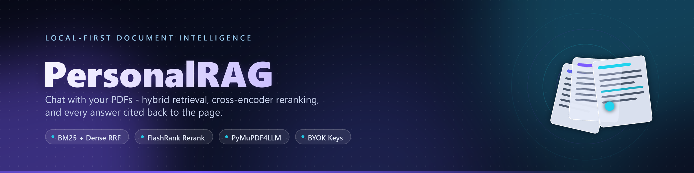

<div align="center">



<br>


</div>

## About

**PersonalRAG** is a local-first document intelligence workspace — upload your PDFs, ask questions in plain language, and get answers that are grounded in the actual pages and cited back to them.

Most "chat with your PDF" tools hand your documents to someone else's server and return confident answers you can't verify. PersonalRAG inverts both defaults: parsing, chunking, and retrieval run in your browser, you bring your own model API key, and every claim in an answer carries a `[Document, p.12]` citation you can click straight through to the source page.

## Why it's different

- **Hybrid retrieval, not just vectors.** Keyword search (BM25) and dense semantic search run in parallel, then fuse via Reciprocal Rank Fusion — so exact terms, names, and figures stay findable alongside conceptual matches.
- **Cross-encoder reranking.** A FlashRank reranker re-scores the fused candidates against the query, pushing genuinely relevant passages to the top before anything reaches the model.
- **Layout-aware parsing.** PyMuPDF4LLM extraction preserves headings, tables, and reading order, so chunks arrive as coherent context instead of shredded text.
- **Contextual chunking.** Each chunk carries a generated header describing where it sits in the document, which measurably improves retrieval on long, structured sources.
- **Citations that resolve.** Answers cite document and page; the built-in viewer jumps to that page.
- **Bring your own key.** Point it at your own model provider. No accounts, no document uploads to a third party.

## Beyond Q&A

A studio mode turns a selected set of sources into derived artifacts:

| Artifact | What you get |
| --- | --- |
| Deep-dive podcast | A two-host dialogue script walking through the material |
| Executive summary | Key findings and takeaways across all selected sources |
| Study guide | Structured notes and review questions |
| Comparison | A cross-document analysis of where sources agree and diverge |

## Architecture

```
Browser (React 19 + Vite + Tailwind + Zustand)
├── PDF extraction ....... pdf.js
├── Chunking ............. contextual, layout-aware
├── Retrieval ............ BM25 (MiniSearch) + dense vectors → RRF fusion
├── Reranking ............ cross-encoder scoring
└── Generation ........... streaming, BYOK, inline citations

Optional Python service (FastAPI)
├── PyMuPDF4LLM .......... high-fidelity layout extraction
├── FlashRank ............ cross-encoder reranking
└── Deploys to ........... Docker / Render / Railway / HF Spaces
```

The browser pipeline is self-contained. The Python service is an optional upgrade path for higher-fidelity parsing and reranking on large or heavily formatted documents.

## Status

This repository is the public home for the project — **the source is still being finished and hasn't landed here yet.** The stack above is built and running locally; code lands once it's cleaned up for release.

Watch the repo to catch the first push.

### Roadmap

- [ ] Publish frontend and backend source
- [ ] Live demo deployment
- [ ] Setup and self-hosting guide
- [ ] Support for more source types beyond PDF
- [ ] Persistent local workspaces

---

<div align="center">
<sub>Built by <a href="https://github.com/hammadshakeelai">@hammadshakeelai</a></sub>
</div>
